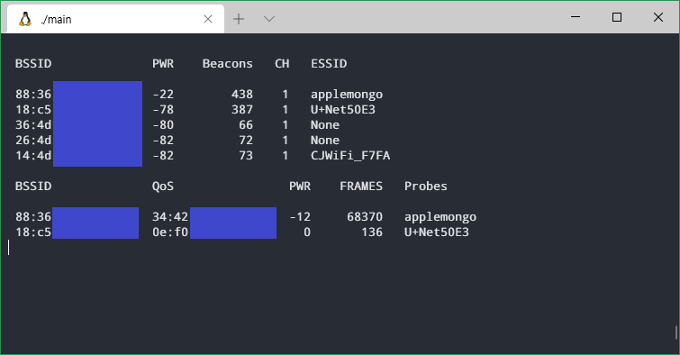

# Report airodump


## Usage
```
$ sudo ./main -i <interface>
$ sudo ./main -i <interface> -bbsid <mac_address>

$ sudo go run main.go -i <interface>
$ sudo go run main.go -i <interface> -bbsid <mac_address>
```

## Install

```
$ sudo apt install libpcap-dev gcc -y 
```

## Go Get
```
sudo go get "github.com/google/gopacket" \
            "github.com/google/gopacket/pcap" \
            "github.com/google/gopacket/layers" \
            "github.com/inancgumus/screen"
```